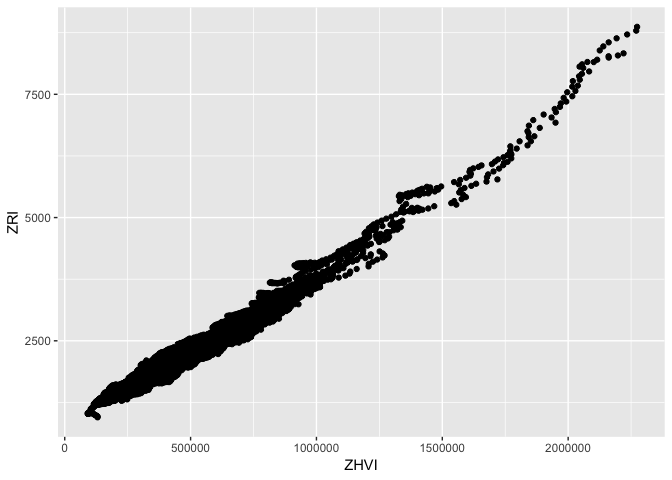

```r
library(tidyverse)
```

```
## ── Attaching packages ────────────────────────────────────────────────────────────────────── tidyverse 1.2.1 ──
```

```
## ✔ ggplot2 3.1.1     ✔ purrr   0.3.2
## ✔ tibble  2.1.1     ✔ dplyr   0.8.1
## ✔ tidyr   0.8.3     ✔ stringr 1.4.0
## ✔ readr   1.3.1     ✔ forcats 0.4.0
```

```
## Warning: package 'ggplot2' was built under R version 3.5.2
```

```
## Warning: package 'tibble' was built under R version 3.5.2
```

```
## Warning: package 'tidyr' was built under R version 3.5.2
```

```
## Warning: package 'purrr' was built under R version 3.5.2
```

```
## Warning: package 'dplyr' was built under R version 3.5.2
```

```
## Warning: package 'stringr' was built under R version 3.5.2
```

```
## Warning: package 'forcats' was built under R version 3.5.2
```

```
## ── Conflicts ───────────────────────────────────────────────────────────────────────── tidyverse_conflicts() ──
## ✖ dplyr::filter() masks stats::filter()
## ✖ dplyr::lag()    masks stats::lag()
```

```r
library(ggplot2)
zillow_data = read_csv("../Desktop/sdss2019_data_hack/Datasets/king_zillow.csv")
```

```
## Parsed with column specification:
## cols(
##   ZHVI = col_double(),
##   date.home = col_date(format = ""),
##   GEO2010 = col_double(),
##   ZRI = col_double()
## )
```

```r
head(zillow_data)
```

```
## # A tibble: 6 x 4
##     ZHVI date.home      GEO2010   ZRI
##    <dbl> <date>           <dbl> <dbl>
## 1 169400 1996-01-31 53033000100    NA
## 2 170200 1996-02-29 53033000100    NA
## 3 169600 1996-03-31 53033000100    NA
## 4 167900 1996-04-30 53033000100    NA
## 5 166700 1996-05-31 53033000100    NA
## 6 166000 1996-06-30 53033000100    NA
```

```r
summary(zillow_data)
```

```
##       ZHVI           date.home             GEO2010         
##  Min.   :  80900   Min.   :1996-01-31   Min.   :5.303e+10  
##  1st Qu.: 216900   1st Qu.:2001-02-28   1st Qu.:5.303e+10  
##  Median : 295050   Median :2006-04-15   Median :5.303e+10  
##  Mean   : 334491   Mean   :2006-04-15   Mean   :5.303e+10  
##  3rd Qu.: 408100   3rd Qu.:2011-05-31   3rd Qu.:5.303e+10  
##  Max.   :2273900   Max.   :2016-06-30   Max.   :5.303e+10  
##  NA's   :4674                                              
##       ZRI       
##  Min.   : 948   
##  1st Qu.:1623   
##  Median :1862   
##  Mean   :1999   
##  3rd Qu.:2249   
##  Max.   :8869   
##  NA's   :69942
```

```r
ggplot(data = zillow_data, mapping = aes(x = ZHVI, y = ZRI)) + geom_point()
```

```
## Warning: Removed 71202 rows containing missing values (geom_point).
```

<!-- -->

# Research Question

How has housing inventory changed over the years in King County?

What regressors are most significant in predicting these changes?

What policies can be targetted to combat these changes?

## Defining the problem

## Merging data

## Cleaning data

## Plots


## Testing the models

## Interpretation and conclusion
