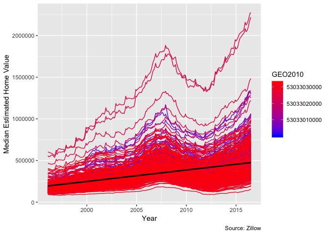
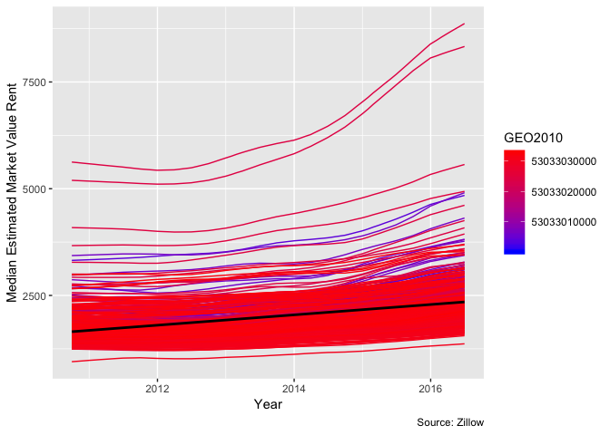
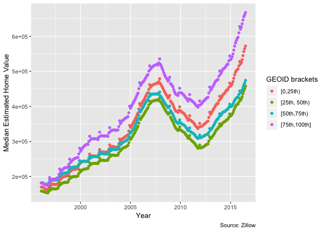
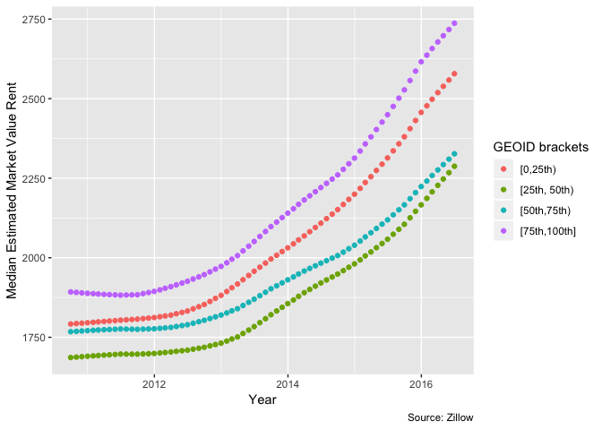
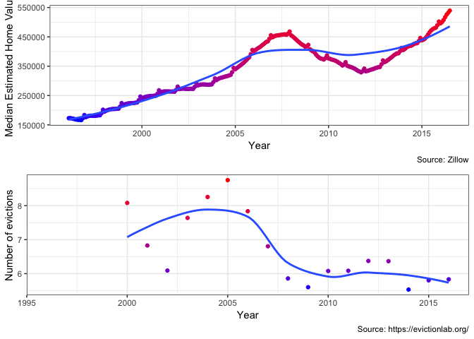
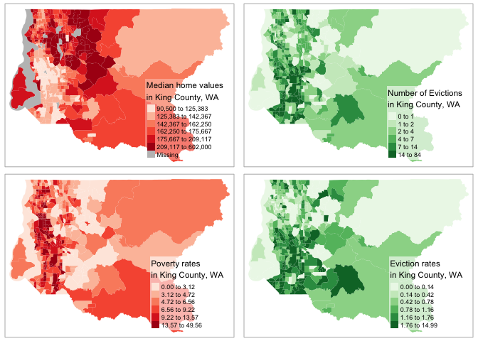

{width=250px}

## Github
https://github.com/timothywetzel/SDSS_Hackathon_Group_2

---

{width=250px}
{width=250px}
{width=250px}

---


## Research Question 

### Background Information

Given the various data sets pertaining to housing inventory, status, and cost, we set out to understand a few things:

1. How has housing cost changed over the years in King County?

2. Is there evidence for spatial relationships in housing insecurity in King County?

3. What local policies can be targeted to combat these changes?

### Defining the Problem

To investigate these questions, we identified data sets that could hold illuminating information pertaining to the above questions.

---

## Data 

As mentioned previously, we focused on particular data sets, namely: 

- Zillow's data for King County's ZHVI (median estimated home value) and ZRI (median estimated market-rate rent)
- 

### Merging Data


### Cleaning Data

---

## Modelling and Visualization

### Plots


First, we have two plots that highlight changing ZHVI and ZRI values in the King County area. The red trend line indicates that there has been (in general) a steady increase in home values and rent indicies. The individual curves suggest some startling upticks in value within the past few years especially.


```
## Warning: Removed 4674 rows containing non-finite values (stat_smooth).
```

```
## Warning: Removed 4674 rows containing missing values (geom_path).
```



What if we collapse the trend lines into an average? We plot the average of the trends below. Across all GEOIDs from the Zillow dataset,  we find both the mean ZHVI and mean ZRI have a general upward trend across time.


Let's move on to spatial plots. The first graph presents median home values by region in King County, with darker and more vibrant <span style="color:red">red</span> indicating higher home values in general.

The second graph provides the total number of evictions in the various areas comprising King County. 

It is appartent that there is some sort of connection between these two, before any analysis has been performed on the data. The lightest <span style="color:red">red</span> areas on the first plot seem to overlap mostly with the darkest <span style="color:green">green</span> areas on the second. This would indicate that areas with lower median home value have *higher* rates of eviction as a whole.


```
## Warning: package 'sf' was built under R version 3.5.2
```

```
## Linking to GEOS 3.6.1, GDAL 2.1.3, PROJ 4.9.3
```



---

### Developing Models

### Evaluating Models

---

## Interpretation and Conclusion

The King County Housing Authority publishes its [policies](https://www.kcha.org/about/policies) online for public viewing. 

From our results, it is apparent that 
